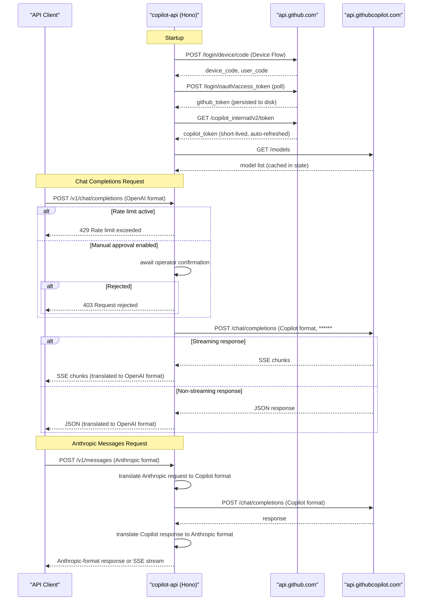

# API & Service Communication Contracts

`copilot-api` exposes 10 HTTP endpoints across 7 route groups, acting as a single-process proxy that translates OpenAI-compatible and Anthropic-compatible requests into GitHub Copilot API calls. All communication is synchronous REST over HTTP/HTTPS.

## Service Catalog

| Service | Port | Category | Purpose |
|---|---|---|---|
| copilot-api (Hono server) | 4141 (default, configurable) | API Layer | Single deployable proxy; translates OpenAI/Anthropic requests to Copilot API calls |
| api.githubcopilot.com | 443 | External / Business | GitHub Copilot inference backend (chat, messages, embeddings, responses, models) |
| api.github.com | 443 | External / Infrastructure | GitHub REST API — OAuth Device Flow, user info, Copilot usage stats |

## API Endpoints Inventory

| Method | Path | Request Type | Response Type | Notes |
|---|---|---|---|---|
| POST | /chat/completions | ChatCompletionsPayload (JSON body) | OpenAI ChatCompletion or SSE stream | Also mounted at /v1/chat/completions |
| POST | /v1/messages | AnthropicMessagesPayload (JSON body) | Anthropic MessagesResponse or SSE stream | Anthropic-compatible; also handles count_tokens |
| POST | /v1/messages/count_tokens | AnthropicCountTokensPayload (JSON body) | Token count JSON | Uses gpt-tokenizer to compute token counts locally |
| POST | /embeddings | EmbeddingRequest (JSON body) | EmbeddingResponse (JSON) | Also mounted at /v1/embeddings |
| GET | /models | — | ModelList JSON (OpenAI-style list) | Also mounted at /v1/models; returns cached model list |
| POST | /responses | ResponsesPayload (JSON body) | OpenAI Responses API response or SSE | Also mounted at /v1/responses |
| GET | /token | — | JSON {token: string} | Returns current short-lived Copilot token (debug use) |
| GET | /usage | — | Copilot usage JSON | Fetches usage stats from GitHub API |
| GET | / | — | plain text | Health/liveness check: "Server running" |
| GET | /dashboard | — | HTML page | Browser dashboard showing token usage UI |
| GET | /sessions | — | JSON array of sessions | Returns all logged sessions (if session logging enabled) |
| GET | /sessions/:id | — | JSON session object | Returns a single session by ID |
| GET | /token-usage | — | JSON usage stats | Returns in-memory token usage statistics |

## Management & Observability Endpoints

| Endpoint | Purpose | Notes |
|---|---|---|
| GET / | Liveness check | Returns plain text "Server running" |
| GET /dashboard | Web UI dashboard | Serves `pages/index.html` — shows token usage |
| GET /token-usage | In-memory usage stats | Returns aggregated token usage counters |
| GET /sessions | Session log browser | Available only when `--session-log` flag is set |
| GET /sessions/:id | Single session detail | Returns stored request/response pair |
| GET /token | Current Copilot token | Intended for debugging; exposes bearer token |

No Prometheus metrics endpoint, no Spring Actuator equivalent, and no OpenAPI/Swagger spec is generated or served.

## DTOs & Contracts

All DTOs are TypeScript types/interfaces validated at runtime with **Zod** schemas. There is no shared OpenAPI specification file.

| DTO / Type | Layer | Role | Immutability |
|---|---|---|---|
| ChatCompletionsPayload | Service | Request body for /chat/completions and /responses | Interface (mutable at runtime) |
| AnthropicMessagesPayload | Route | Request body for /v1/messages | Interface (mutable at runtime) |
| AnthropicCountTokensPayload | Route | Request body for /v1/messages/count_tokens | Interface |
| EmbeddingRequest | Service | Request body for /embeddings | Interface |
| ModelsResponse | Service | Response from Copilot models API; cached in state | Interface |
| State | Lib | Global mutable singleton holding tokens and config flags | Mutable (plain object) |

Request and response schemas are validated inline inside route handlers using Zod `.parse()` / `.safeParse()`. No separate contract file (proto, GraphQL schema, openapi.yaml) exists. See `data-architecture.md` for field-level details.

## Communication Patterns

**Synchronous (REST)**: All client-facing endpoints and all upstream calls are synchronous HTTPS REST. Clients communicate with the proxy over plain HTTP (no TLS on the server side). The proxy communicates with `api.githubcopilot.com` and `api.github.com` over HTTPS using `undici` as the HTTP client.

**Streaming**: For streaming responses, the proxy reads SSE (Server-Sent Events) from the Copilot backend via `fetch-event-stream` and forwards chunks directly to the client, translating chunk formats on the fly (Copilot → OpenAI or Copilot → Anthropic SSE format).

**No asynchronous messaging**: There are no message queues, event buses, or pub/sub patterns. All interactions are request/response.

**Rate limiting**: An optional configurable rate limit (`--rate-limit N` seconds between requests) is enforced globally in-process. When the limit is exceeded, the proxy either returns HTTP 429 immediately or waits (blocking the request) depending on the `--wait` flag. No distributed rate limiting or external rate-limit store is used.

**Manual approval gate**: An optional `--manual` flag pauses each request at the CLI prompt until the operator confirms or rejects it. Rejected requests return HTTP 403.

**Token auto-refresh**: The short-lived Copilot token is refreshed automatically via a `setInterval` timer; no external coordination is required.

**Proxy support**: Outbound HTTP calls honour proxy settings from environment variables (`HTTP_PROXY`, `HTTPS_PROXY`, `NO_PROXY`) via `proxy-from-env`, configurable at startup with `--proxy-env`.

**Service discovery**: No service discovery. Upstream endpoints are hardcoded (`api.githubcopilot.com`, `api.github.com`).

**Resilience**: No circuit breaker, bulkhead, or retry policy. Failed upstream calls propagate the error to the client as-is via `forwardError`, which serialises the upstream HTTP response status and body.

**Security posture**: The proxy server itself has **no authentication or TLS**. Any client that can reach the server's port can call all endpoints, including `/token` (which exposes the live Copilot bearer token). CORS is enabled for all origins via Hono's `cors()` middleware. Transport security, API keys, and access control are entirely the operator's responsibility (e.g., bind to `localhost` only, use a reverse proxy with TLS).

## Service Technology Matrix

| Capability | copilot-api |
|---|---|
| Web framework | Hono v4.9.9 on srvx |
| Data access | None (no database) |
| Service discovery | None (hardcoded URLs) |
| API gateway | Self (acts as gateway/proxy) |
| Health checks | GET / (plain text) |
| Caching | In-memory (state.models, state.copilotToken) |
| Metrics | In-memory token usage counter (/token-usage) |
| Tracing | None |
| Auth (inbound) | None |
| Auth (outbound) | ****** (GitHub token → Copilot token) |

## Service Communication Sequence

