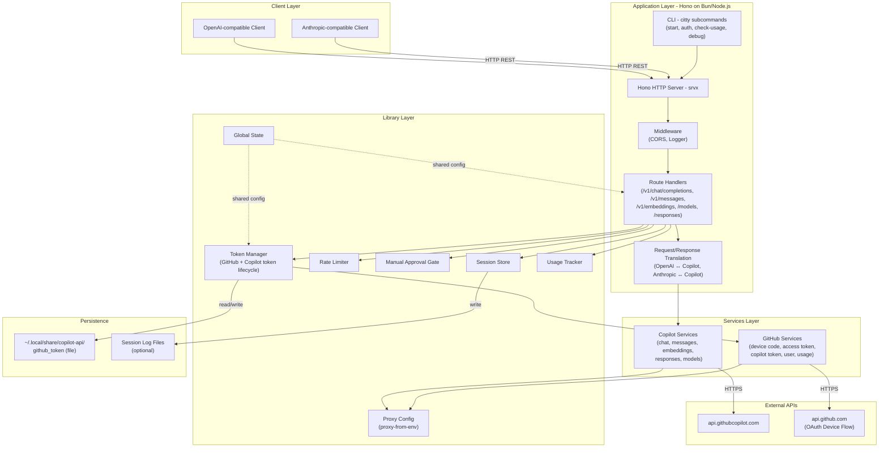
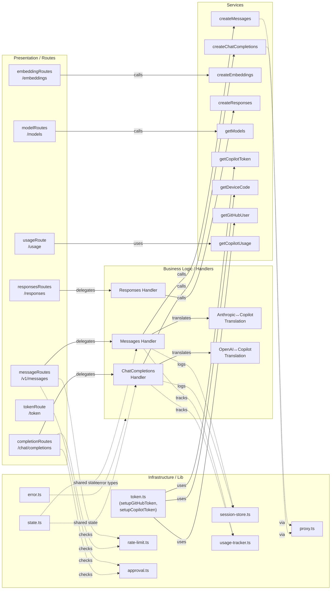

# Architecture Diagram

This document describes the architecture of `copilot-api`, a local proxy server that wraps GitHub Copilot's backend API and exposes it as OpenAI-compatible and Anthropic-compatible REST endpoints.

## Application Architecture

### Technology Stack Summary

| Layer | Technology | Version | Purpose |
|---|---|---|---|
| Runtime | Bun / Node.js | Bun 1.x / Node 22 | JavaScript runtime for execution |
| HTTP Framework | Hono | ^4.9.9 | Lightweight web framework for routing |
| HTTP Server | srvx | ^0.8.9 | Cross-runtime HTTP server adapter |
| CLI Framework | citty | ^0.1.6 | Subcommand CLI definition |
| Schema Validation | Zod | ^4.1.11 | Request/response schema validation |
| HTTP Client | undici | ^7.16.0 | Fetch-based HTTP client for upstream calls |
| Tokenizer | gpt-tokenizer | ^3.0.1 | Token counting for Anthropic token endpoint |
| Streaming | fetch-event-stream | ^0.1.5 | SSE streaming from Copilot API |
| Logging | consola | ^3.4.2 | Structured console logging |
| Proxy | proxy-from-env | ^1.1.0 | HTTP proxy configuration from env vars |
| Clipboard | clipboardy | ^5.0.0 | Copy auth codes to clipboard |

### Data Storage & External Services

The application stores a single GitHub OAuth token to disk at `~/.local/share/copilot-api/github_token`. All other runtime data (the short-lived Copilot token, global configuration flags, model list, VSCode version) lives in an in-memory state object. Optionally, session logs (request/response pairs) are persisted as JSON files for debugging. The two external services are `api.github.com` (for OAuth Device Flow and usage queries) and `api.githubcopilot.com` (for all AI inference calls). HTTP proxy settings are automatically respected from environment variables via `proxy-from-env`.

### Key Architectural Decisions

- **Protocol translation layer**: Incoming OpenAI-format or Anthropic-format requests are translated into Copilot API format on the fly inside the route handlers, allowing any OpenAI/Anthropic-compatible client to work without modification.
- **Token auto-refresh**: A short-lived Copilot token is obtained on startup and automatically refreshed on a timer (configurable by the `refresh_in` field returned by the API), keeping the proxy usable indefinitely without user interaction.
- **Global mutable state**: A single `state` object holds all runtime configuration (tokens, feature flags, model cache), shared across all request handlers for simplicity in a single-process server.

## Component Relationships

### Component Inventory

| Component | Layer | Type | Responsibility |
|---|---|---|---|
| completionRoutes | Presentation | Hono Router | Handles OpenAI `/chat/completions` endpoint |
| messageRoutes | Presentation | Hono Router | Handles Anthropic `/v1/messages` endpoint |
| embeddingRoutes | Presentation | Hono Router | Handles `/embeddings` endpoint |
| modelRoutes | Presentation | Hono Router | Lists available Copilot models |
| responsesRoutes | Presentation | Hono Router | Handles OpenAI Responses API endpoint |
| tokenRoute | Presentation | Hono Router | Exposes current Copilot token for debugging |
| usageRoute | Presentation | Hono Router | Returns GitHub Copilot usage stats |
| ChatCompletions Handler | Business Logic | Request Handler | Validates, optionally approves, and streams chat responses |
| Messages Handler | Business Logic | Request Handler | Validates and processes Anthropic-format messages |
| Responses Handler | Business Logic | Request Handler | Handles OpenAI Responses API requests |
| Anthropic↔Copilot Translation | Business Logic | Translator | Converts Anthropic request/response format to/from Copilot format |
| OpenAI↔Copilot Translation | Business Logic | Translator | Converts OpenAI streaming chunks to/from Copilot format |
| createChatCompletions | Services | API Client | Calls Copilot chat completions upstream |
| createMessages | Services | API Client | Calls Copilot messages API upstream |
| createEmbeddings | Services | API Client | Calls Copilot embeddings upstream |
| createResponses | Services | API Client | Calls Copilot responses API upstream |
| getModels | Services | API Client | Fetches available model list from Copilot |
| getCopilotToken | Services | API Client | Exchanges GitHub token for short-lived Copilot token |
| getDeviceCode / pollAccessToken | Services | API Client | GitHub OAuth Device Flow implementation |
| token.ts | Infrastructure | Token Manager | Orchestrates token setup and auto-refresh lifecycle |
| rate-limit.ts | Infrastructure | Middleware Lib | Enforces per-request rate limiting delay |
| approval.ts | Infrastructure | Middleware Lib | Optional manual approval gate before forwarding requests |
| state.ts | Infrastructure | Global State | Mutable singleton holding tokens, flags, and cached data |
| session-store.ts | Infrastructure | Storage | Reads/writes session log files to disk |
| usage-tracker.ts | Infrastructure | Tracker | Tracks token usage statistics in memory |
| proxy.ts | Infrastructure | HTTP Config | Configures undici dispatcher with proxy-from-env settings |
| error.ts | Infrastructure | Error Types | Custom error classes (HTTPError, etc.) |
