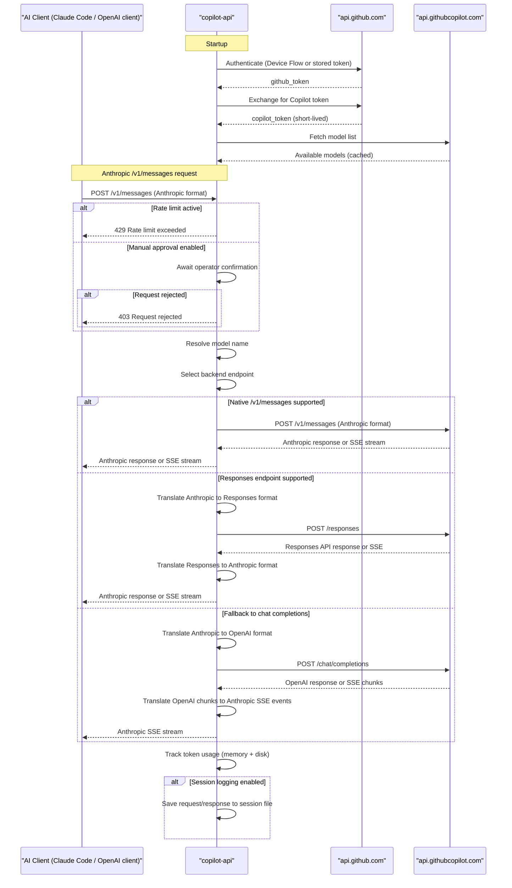

# Core Business Workflows

`copilot-api` is a protocol translation proxy that allows AI development tools (such as Claude Code, Cursor, and any OpenAI-compatible client) to use GitHub Copilot's AI models as their inference backend by presenting a fully compatible OpenAI and Anthropic API surface.

## Domain Entities

| Entity | Service / Bounded Context | Description | Key Relationships |
|---|---|---|---|
| GitHub OAuth Token | Authentication | Long-lived credential that identifies the GitHub user | Prerequisite for obtaining a Copilot Token |
| Copilot Token | Authentication | Short-lived bearer token authorizing AI inference calls | Derived from GitHub OAuth Token; auto-refreshed |
| Model | Model Management | An AI model available via the Copilot backend (id, capabilities, supported endpoints) | Selected per-request; determines endpoint routing and token limits |
| Chat Completions Request | Request Translation | An OpenAI-format inference request (messages, model, streaming flag, tools) | Translated to the appropriate Copilot backend endpoint |
| Anthropic Messages Request | Request Translation | An Anthropic-format inference request (messages, system prompt, tools, thinking) | Translated to OpenAI or native Anthropic format before forwarding |
| Session Record | Session Logging | A stored request/response pair captured during a model interaction (optional) | Grouped by session ID; written to session log files |
| Model Usage | Usage Tracking | Accumulated token counts per model (input, output, cache read, request count) | Persisted per-model; updated after every completed inference call |

## Service-to-Domain Mapping

This project is a single-process application; there are no microservices. The logical bounded contexts within the process are:

| Module | Domain Context | Owned Domain Data | External Dependencies |
|---|---|---|---|
| `src/lib/token.ts` | Authentication | GitHub OAuth token (disk), Copilot token (memory) | api.github.com (Device Flow, token exchange) |
| `src/routes/chat-completions/` | OpenAI Protocol Translation | None (stateless translation) | Copilot backend (`/chat/completions`, `/responses`) |
| `src/routes/messages/` | Anthropic Protocol Translation | Session records (optional) | Copilot backend (`/v1/messages`, `/chat/completions`, `/responses`) |
| `src/routes/embeddings/` | Embeddings Passthrough | None | Copilot backend (`/embeddings`) |
| `src/routes/models/` | Model Catalogue | Cached model list (memory) | Copilot backend (`/models`) |
| `src/lib/usage-tracker.ts` | Usage Metering | Per-model token counters (memory + disk) | None |
| `src/lib/session-store.ts` | Session Logging | Session JSON files (disk) | Filesystem |

## Primary Workflows

### Workflow 1: GitHub Authentication (Device Flow)

Triggered by the `auth` subcommand or automatically by `start` when no token is on disk.

1. The server calls `GET /login/device/code` on `api.github.com` with the registered Client ID to obtain a `device_code` and a `user_code`.
2. The user is shown the `user_code` and directed to `github.com/login/device`.
3. The server polls `POST /login/oauth/access_token` until the user authorises or the code expires.
4. On success, the GitHub OAuth token is persisted to `~/.local/share/copilot-api/github_token` with `chmod 600`.
5. The token is immediately used to fetch a short-lived Copilot token (Step 3 of startup).

### Workflow 2: Server Startup & Readiness

Triggered by the `start` subcommand:

1. Optionally configure proxy from environment variables (`--proxy-env`).
2. Ensure the data directory and token file exist on disk.
3. Fetch the current VSCode version from the AUR package build file (with 5-second timeout; falls back to hardcoded `1.104.3`).
4. Load the GitHub OAuth token from disk (or run Device Flow if absent/forced).
5. Exchange the GitHub token for a short-lived Copilot bearer token; start the auto-refresh timer.
6. Fetch and cache the full model list from `api.githubcopilot.com`.
7. Optionally prompt the user to select models for Claude Code and copy the launch command to the clipboard.
8. Bind the HTTP server on the configured port (default: 4141) and begin accepting requests.

### Workflow 3: OpenAI Chat Completions Request Proxy

Triggered by `POST /chat/completions` or `POST /v1/chat/completions`:

1. **Rate limit check** — if `--rate-limit` is configured and too little time has elapsed since the last request, either wait or return HTTP 429.
2. Parse the incoming OpenAI `ChatCompletionsPayload`.
3. **Model name resolution** — resolve the requested model name: exact match → case-insensitive match → (optionally) Levenshtein fuzzy match → pass through unchanged.
4. Calculate the token count for informational logging (non-blocking; errors are warned and ignored).
5. **Manual approval gate** — if `--manual` is enabled, pause and wait for interactive operator confirmation; reject with HTTP 403 if declined.
6. **Token limit injection** — if neither `max_tokens` nor `max_completion_tokens` was specified, inject the model's `max_output_tokens` from the cached model capabilities.
7. **GPT-5+ parameter stripping** — if the model matches the GPT-5-or-above pattern, remove unsupported parameters (`temperature`, `top_p`, `stop`, `frequency_penalty`, `presence_penalty`).
8. **Endpoint selection** — consult the model's `supported_endpoints` list; prefer native format, then `/responses`, then `/chat/completions`.
9. Forward to the Copilot backend.
10. For non-streaming responses: track token usage, return JSON.
11. For streaming responses: forward SSE chunks, track usage from the final usage chunk.

### Workflow 4: Anthropic Messages Request Proxy

Triggered by `POST /v1/messages`:

1. **Rate limit check** (same as Workflow 3).
2. Parse the incoming Anthropic `AnthropicMessagesPayload`; extract optional `session_id` from `metadata.user_id`.
3. **Model name resolution** (same as Workflow 3).
4. **Manual approval gate** (same as Workflow 3).
5. **Endpoint selection** — same logic as Workflow 3; produces one of: `/v1/messages` (native), `/responses`, or `/chat/completions`.
6. **Path-dependent handling**:
   - **Native `/v1/messages`**: Strip unsupported fields (thinking if not supported, temperature/top_p/stop_sequences for GPT-5+); forward directly; translate `thinking` mode to `adaptive` if the model supports `adaptive_thinking`.
   - **Via `/responses`**: Translate the Anthropic payload to OpenAI Responses API format; forward; translate the response back to Anthropic format.
   - **Via `/chat/completions`**: Translate the Anthropic payload to OpenAI ChatCompletions format; forward; translate response and SSE chunks back to Anthropic SSE events.
7. Track token usage on completion.
8. Optionally persist the full request/response pair to the session log file (if `--session-log` is enabled and a `session_id` was extracted).

### Workflow 5: Token Count (Anthropic)

Triggered by `POST /v1/messages/count_tokens`:

1. Parse the Anthropic `AnthropicCountTokensPayload`.
2. Use `gpt-tokenizer` to count tokens locally (no upstream call).
3. Return the token count as a JSON response.

## Cross-Service Data Flows

This is a single-process proxy; there are no microservices. Cross-component data flows occur within the process:

- **Authentication → Inference**: The `setupCopilotToken` function (in `token.ts`) obtains and stores the Copilot bearer token in `state.copilotToken`. Every outbound inference call (in `services/copilot/*`) reads `state.copilotToken` from this shared object.
- **Model cache → Request handlers**: `cacheModels()` (run at startup) populates `state.models`. All request handlers look up the requested model in this cache to determine capabilities (max tokens, supported endpoints, adaptive thinking support).
- **Endpoint selector → Service calls**: `selectEndpoint()` inspects the model's `supported_endpoints` list to decide which upstream API path to call. The handler then dispatches to `createChatCompletions`, `createMessages`, or `createResponses` accordingly.
- **Response translation → Usage tracking**: After every inference call, `trackUsage()` is called with the usage counters extracted from the response. This increments the in-memory `usageByModel` map and flushes synchronously to `token-usage.json`.
- **Fallback behavior**: If the endpoint selector cannot find a supported endpoint in the model's list, it falls back to `/chat/completions`. If `cacheVSCodeVersion()` times out or fails, the hardcoded fallback version `1.104.3` is used. If `getTokenCount()` throws, the error is logged and the request proceeds.

## Business Workflow Sequence

## Business Rules & Decision Logic

### Validation Rules

- **Model resolution**: Requested model names are resolved against the cached model list via exact match, case-insensitive match, and (optionally) Levenshtein fuzzy match with a 20% relative distance threshold. Unresolvable names are passed through unchanged to the upstream API.
- **Token limit injection**: If neither `max_tokens` nor `max_completion_tokens` is set in the request, the model's `max_output_tokens` capability value is injected automatically. This prevents upstream API errors for models that require an explicit limit.
- **GPT-5+ parameter filtering**: For models matching the pattern `gpt-5` or higher (`/^gpt-([5-9]|\d{2,})/`), the parameters `temperature`, `top_p`, `stop`, `frequency_penalty`, and `presence_penalty` are stripped before forwarding, as the GPT-5 series API does not accept them.
- **Adaptive thinking**: If an Anthropic request includes a `thinking` block, it is forwarded only if the selected model supports `adaptive_thinking` (checked via model capabilities). Otherwise the `thinking` field is stripped.

### Decision Logic

- **Endpoint selection priority**: For a given request format and model, the endpoint is chosen as: (1) native format endpoint if supported, (2) highest-priority alternative in order `[/responses, /v1/messages, /chat/completions]`, (3) fallback to `/chat/completions`.
- **Rate limiting**: If `--rate-limit N` is set and the elapsed time since the last request is less than N seconds, either reject with 429 or block until the window expires (controlled by `--wait` flag).
- **Streaming vs non-streaming**: Determined by the presence of a `choices` array (non-streaming) or an SSE event stream (streaming) in the Copilot API response.

### State Transitions

- **Token lifecycle**: `uninitialized` → `active` (after Device Flow or disk read + exchange) → `refreshed` (after auto-refresh timer fires). The Copilot token refreshes `refresh_in - 60` seconds before expiry.
- **Model cache**: `empty` → `populated` (at startup after `cacheModels()` succeeds). Never evicted during the process lifetime.

### Cross-Cutting Concerns

- **Error handling**: HTTP errors from upstream APIs are wrapped in a custom `HTTPError` class and forwarded to the client via `forwardError()`, which serialises the upstream status code and response body. Rate limit errors return 429; approval rejections return 403.
- **Session logging**: Optional; activated by `--session-log`. Session IDs are extracted from the Anthropic `metadata.user_id` JSON field. Full request and response bodies are written to `sessions/<sessionId>.json`. Logging failures are warned but do not affect the response.
- **Usage tracking**: Every completed request records input tokens, output tokens, and cache-read tokens by model name. Counts are accumulated in memory and synchronously flushed to `token-usage.json` to survive process restarts.
- **Authorization**: None. All endpoints are accessible without authentication. The operator is responsible for network-level isolation.
