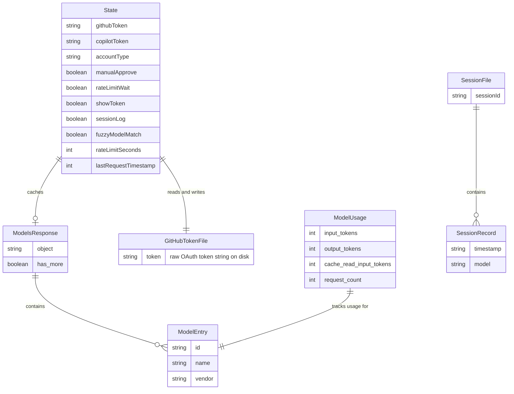

# Data Architecture & Persistence Layer

`copilot-api` has no relational database, ORM, or migration tooling. All persistent state is limited to a single plaintext credential file on disk and optional JSON session log files; runtime data is held entirely in memory.

## Database Configuration

| Store | Type | Profile | Driver / Access | Location | Migration Tool |
|---|---|---|---|---|---|
| GitHub token file | Plaintext file | All environments | Node.js `fs` (read/write) | `~/.local/share/copilot-api/github_token` | None |
| Session log files | JSON files (optional) | When `--session-log` is set | Node.js `fs` (append/read) | `<project-root>/sessions/<sessionId>.json` | None |
| Token usage file | JSON file | All environments | Node.js `fs` (read/write, synchronous) | `<project-root>/token-usage.json` | None |
| In-memory state | Runtime object | All environments | Direct JS object mutation | Process memory (`src/lib/state.ts`) | N/A |

No relational database, document database, cache server, or migration toolchain is used. See `configuration-inventory.md` for environment variable and startup configuration details.

## Data Ownership per Service

| Service | Data Stores Owned | ORM / Access Layer | Caching | Notes |
|---|---|---|---|---|
| copilot-api (single process) | GitHub token file, session log files, token-usage.json, in-memory state | Raw Node.js `fs` module | In-memory (`state.models`, `state.copilotToken`) | No ORM; all I/O is raw file system reads and JSON serialization |

## Entity Model

> Note: This project has no ORM entities or relational schema. The diagram below models the logical data shapes stored and passed through the system.

## Key Repository Methods

| Module | Interface / Function | Signature | Purpose |
|---|---|---|---|
| `lib/token.ts` | `setupGitHubToken` | `setupGitHubToken(options?) → Promise<void>` | Reads GitHub token from disk; runs Device Flow if absent |
| `lib/token.ts` | `setupCopilotToken` | `setupCopilotToken() → Promise<void>` | Exchanges GitHub token for short-lived Copilot token; schedules auto-refresh |
| `lib/paths.ts` | `ensurePaths` | `ensurePaths() → Promise<void>` | Creates app dir and token file with `chmod 600` if missing |
| `lib/session-store.ts` | `addRecord` | `addRecord(sessionId, model, request, response) → Promise<void>` | Appends a request/response record to `sessions/<id>.json` |
| `lib/session-store.ts` | `getSessions` | `getSessions() → Promise<SessionSummary[]>` | Lists all session files sorted by modification time |
| `lib/session-store.ts` | `getSession` | `getSession(sessionId) → Promise<SessionFile|null>` | Reads a single session file by ID |
| `lib/usage-tracker.ts` | `trackUsage` | `trackUsage(model, usage) → void` | Increments per-model token counters in memory and flushes to `token-usage.json` synchronously |
| `lib/usage-tracker.ts` | `getUsageStats` | `getUsageStats() → Record<string, ModelUsage>` | Returns snapshot of in-memory usage counters |
| `lib/utils.ts` | `cacheModels` | `cacheModels() → Promise<void>` | Fetches model list from Copilot API and writes result to `state.models` |

## Caching Strategy

| Cache | Type | Location | Eviction / TTL | Pattern |
|---|---|---|---|---|
| Model list (`state.models`) | In-memory (process lifetime) | `state.ts` global object | Fetched once at startup; never evicted (process restart required) | Cache-aside (lazy load at startup, fallback re-fetch on demand) |
| Copilot token (`state.copilotToken`) | In-memory (process lifetime) | `state.ts` global object | Refreshed on a timer based on `refresh_in` field from Copilot API (typically every ~25 min) | Time-based refresh via `setInterval` |
| VSCode version (`state.vsCodeVersion`) | In-memory (process lifetime) | `state.ts` global object | Fetched once at startup; never evicted | Cache-aside |
| Token usage counters (`usageByModel`) | In-memory `Map` + file flush | `usage-tracker.ts` module-level `Map` + `token-usage.json` | Persisted synchronously on every write; loaded from file at startup | Write-through to local JSON file |

No external cache server (Redis, Memcached, etc.) is used. All caching is in-process and non-distributed; data is lost on process restart except for the token usage counters, which are persisted to disk.

## Data Ownership Boundaries

All data is owned by the single `copilot-api` process. There are no distributed services, shared databases, or cross-service data access patterns. Data stores are isolated to the local machine:

- **GitHub token file**: Written during the `auth` subcommand, read during the `start` subcommand. No other process accesses it (except the OS filesystem).
- **Session logs**: Written during request handling (when `--session-log` is enabled). Read via the `/sessions` and `/sessions/:id` API endpoints. Not shared with any external system.
- **Token usage file**: Written synchronously after every tracked request. Read at startup to restore counters. Shared only within the single process.
- **In-memory state**: A plain JavaScript object singleton shared across all in-process route handlers. No serialization or cross-process access.

### Data Classification & Sensitivity

| Data Store | Sensitive Fields | Classification | Controls in Place |
|---|---|---|---|
| GitHub token file (`github_token`) | GitHub OAuth access token | Credential / Secret | File created with `chmod 600` (owner read/write only); token string stored in plaintext |
| In-memory state (`state.copilotToken`) | Short-lived Copilot bearer token | Credential / Secret | In-memory only; exposed via `/token` endpoint (no auth required — see `api-service-contracts.md`) |
| Session log files | Full request and response bodies (may contain user prompts and AI responses) | Potentially sensitive (PII in prompt content) | Opt-in (`--session-log`); stored as plaintext JSON; no encryption-at-rest, no access controls beyond OS filesystem permissions |
| Token usage file | Per-model token counts and request counts | Non-sensitive operational data | None required |

The GitHub token is stored in plaintext on disk; its confidentiality relies entirely on the `0600` file permission. The Copilot token is exposed over an unauthenticated HTTP endpoint (`/token`), creating a risk if the server is accessible beyond `localhost`. Session logs may contain sensitive prompt content but are opt-in, stored without encryption, and have no access controls beyond filesystem permissions.
