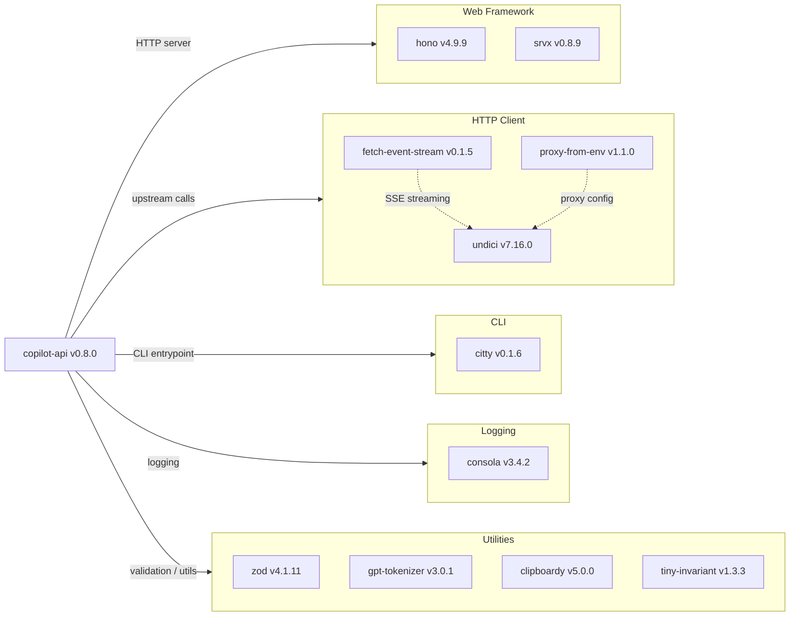

# Dependency Map

`copilot-api` is a TypeScript/Bun project with 11 production dependencies and 11 development dependencies (22 total declared).

## Dependencies

### Dependency Summary

| Category | Count | Key Libraries | Notes |
|---|---|---|---|
| Web Framework | 2 | hono v4.9.9, srvx v0.8.9 | Modern lightweight framework; srvx is a cross-runtime adapter |
| HTTP Client | 3 | undici v7.16.0, fetch-event-stream v0.1.5, proxy-from-env v1.1.0 | undici is Node.js's modern built-in-level HTTP client |
| CLI | 1 | citty v0.1.6 | Lightweight CLI argument parser with subcommands |
| Logging | 1 | consola v3.4.2 | Structured console logger |
| Utilities | 4 | zod v4.1.11, gpt-tokenizer v3.0.1, clipboardy v5.0.0, tiny-invariant v1.3.3 | Schema validation, token counting, clipboard access, runtime assertions |

### Version & Compatibility Risks

All production dependencies are actively maintained and at modern major versions. `hono` v4.x and `srvx` v0.8.x are current stable releases well-suited for Bun/Node.js runtimes. `undici` v7.x is the latest major line. `zod` v4.1.x is the most recent major version. `citty` v0.1.x is still in pre-1.0 versioning, meaning the API could change in minor releases. `fetch-event-stream` v0.1.5 is also pre-1.0, introducing potential instability. No dependencies are end-of-life or known to carry critical CVEs at these versions. The `ncu` output (see `report-javascript-typescript.md`) identifies several minor and major update candidates (e.g., `hono` → ^4.12.25, `undici` → v8, `typescript` → v6, `eslint` → v10).

### Notable Observations

- **Pre-1.0 dependencies**: Both `citty` (^0.1.6) and `fetch-event-stream` (^0.1.5) are pre-1.0 packages with no stability guarantees; API changes could occur in patch or minor releases.
- **Lean dependency footprint**: Only 11 production dependencies for a proxy server — deliberate minimalism that reduces supply-chain attack surface and maintenance burden.
- **No authentication library**: GitHub OAuth Device Flow is implemented directly against the GitHub REST API with `undici` rather than using an OAuth client library, keeping dependencies minimal but increasing custom auth code.
- **Major version upgrades available**: The `ncu` assessment identifies `undici` (v7 → v8), `eslint` (v9 → v10), `typescript` (v5 → v6), `knip` (v5 → v6), and `tsdown` (v0.15 → v0.22) as major-version update candidates that warrant careful review before upgrading.

## Test Dependencies

| Framework | Version | Notes |
|---|---|---|
| Bun Test Runner | built-in (Bun 1.x) | Uses `bun:test` — no separate install required |
| zod | ^4.1.11 | Used in tests for schema assertions (shared with production) |

Total test-scope dependencies: 1 (Bun's built-in test runner, no additional test packages declared)

The project uses Bun's built-in `bun:test` runner (a Jest-compatible API), so there are no separately-declared test-framework packages in `package.json`. Test utilities such as `describe`, `test`, `expect`, and `mock` are provided by the runtime itself. No integration test framework, contract testing library, or code coverage tool is declared.
