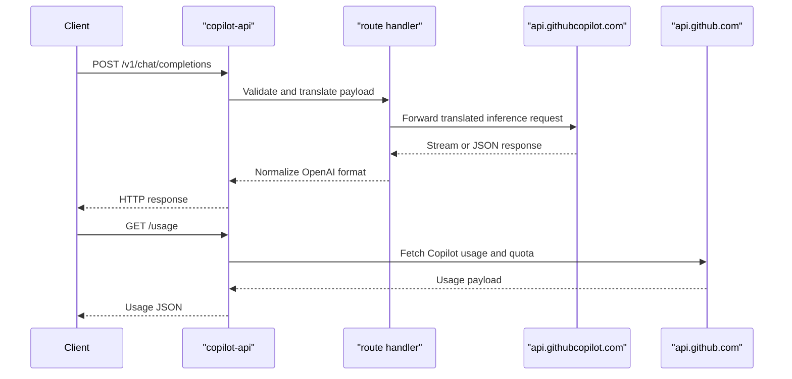

# API & Service Communication Contracts

This application exposes a single proxy service with OpenAI-compatible and Anthropic-compatible endpoints and forwards requests synchronously to GitHub Copilot and GitHub APIs.

## Service Catalog

| Service | Port | Category | Purpose |
|---|---:|---|---|
| copilot-api (main service) | 4141 (default) | API Layer | Accepts client API requests and translates/proxies them upstream |

## API Endpoints Inventory

| Service | Method | Path | Request Type | Response Type |
|---|---|---|---|---|
| copilot-api | GET | `/` | none | plain text health response |
| copilot-api | GET | `/dashboard` | none | HTML dashboard page |
| copilot-api | GET | `/sessions` | none | JSON list of session summaries |
| copilot-api | GET | `/sessions/:id` | path: `id` | JSON session details or 404 |
| copilot-api | GET | `/token-usage` | none | JSON usage totals by model |
| copilot-api | POST | `/chat/completions`, `/v1/chat/completions` | OpenAI chat completion payload | OpenAI chat response or stream |
| copilot-api | POST | `/responses`, `/v1/responses` | OpenAI Responses payload | Responses API format output |
| copilot-api | POST | `/v1/messages` | Anthropic messages payload | Anthropic-compatible output |
| copilot-api | POST | `/v1/messages/count_tokens` | Anthropic token-count payload | token count JSON |
| copilot-api | GET | `/v1/models`, `/models` | none | OpenAI-compatible model list |
| copilot-api | POST | `/v1/embeddings`, `/embeddings` | embeddings payload | embeddings response |
| copilot-api | GET | `/usage` | none | Copilot quota and usage data |
| copilot-api | GET | `/token` | none | current token JSON |

## Management & Observability Endpoints

| Service | Endpoint | Custom Metrics (if any) |
|---|---|---|
| copilot-api | `/`, `/sessions`, `/token-usage` | No dedicated metrics endpoint found |

## DTOs & Contracts

The API contract is primarily schema-based via TypeScript and Zod models across route handlers and translation modules. Request contracts include OpenAI chat/responses payloads, Anthropic messages payloads, and embedding request objects (e.g., `EmbeddingRequest` in `services/copilot/create-embeddings`). Response contracts are translated into OpenAI-compatible and Anthropic-compatible schemas for downstream clients. No OpenAPI, protobuf, or GraphQL schema files were detected.

## Communication Patterns

All inter-service communication is synchronous HTTP between this proxy service and external GitHub endpoints (`api.githubcopilot.com`, `api.github.com`) using outbound service modules. No asynchronous message broker integration was found. Retry/circuit-breaker policy frameworks are not explicitly configured in the codebase. Service discovery is not used; upstream endpoints are known service URLs. TLS/auth are delegated to GitHub APIs for upstream calls, while local server endpoints do not enforce built-in authentication/authorization by default.

## Service Technology Matrix

| Service | Web | Data Access | Discovery | Gateway | Actuator | Cache | Metrics |
|---|---|---|---|---|---|---|---|
| copilot-api | Hono | Local JSON file persistence | None | Yes (protocol translation proxy) | Basic root route only | In-memory + file-based model/usage data | No exporter detected |

## Service Communication Sequence

