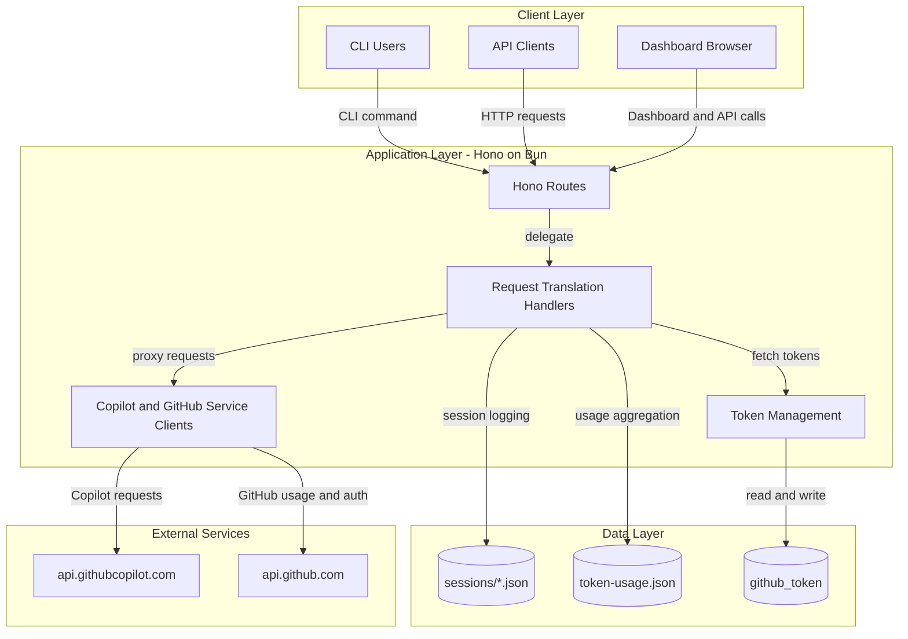
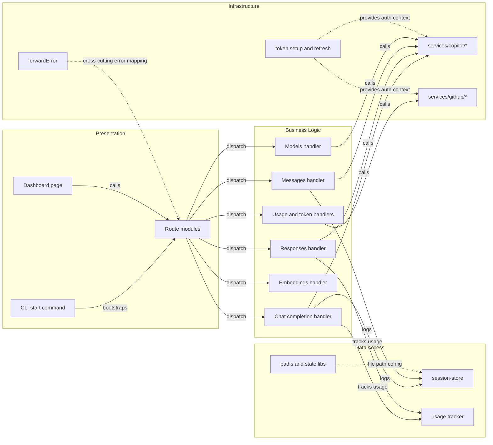

# Architecture Diagram

This project is a single Node.js/Bun service that exposes OpenAI and Anthropic compatible APIs and proxies requests to GitHub Copilot backend services. It also includes local usage/session persistence and a built-in dashboard.

## Application Architecture

### Technology Stack Summary

| Layer | Technology | Version | Purpose |
|---|---|---|---|
| Presentation | Static HTML dashboard | N/A | Display usage and session records |
| API | Hono | ^4.9.9 | REST endpoint routing |
| Runtime | Bun | >=1.2.x | JavaScript runtime and package management |
| Service Integration | Undici and fetch-event-stream | ^7.16.0 / ^0.1.5 | Upstream HTTP and streaming requests |
| Validation | Zod | ^4.1.11 | Request validation and schema parsing |
| Persistence | Local JSON files via Node fs | Built-in | Session, usage, and token persistence |

### Data Storage & External Services

The service persists operational data in local JSON files (`sessions/`, `token-usage.json`, and a token file in the user app directory) rather than a relational database. It integrates with GitHub APIs for authentication and usage checks and with GitHub Copilot backend APIs for inference and model operations.

### Key Architectural Decisions

- Uses a single-process proxy architecture with route-specific translation logic for OpenAI, Responses, and Anthropic compatibility.
- Keeps persistence lightweight through file-based storage instead of external databases.
- Centralizes authentication/token lifecycle in shared token utilities used by all outbound service calls.

## Component Relationships

### Component Inventory

| Component | Layer | Type | Responsibility |
|---|---|---|---|
| `src/start.ts` | Presentation | CLI command module | Parses options and starts the server runtime |
| `src/server.ts` | Presentation | Route composition module | Registers public routes and API compatibility routes |
| `src/routes/*/route.ts` | Presentation | Route modules | Exposes endpoint handlers per API domain |
| `src/routes/*/handler.ts` | Business Logic | Request translator/handler | Validates input and translates provider formats |
| `src/services/copilot/*` | Infrastructure | HTTP service clients | Sends model and generation requests to Copilot backend |
| `src/services/github/*` | Infrastructure | HTTP service clients | Handles GitHub usage and auth-related API calls |
| `src/lib/token.ts` | Infrastructure | Token lifecycle module | Loads, refreshes, and stores auth tokens |
| `src/lib/session-store.ts` | Data Access | File persistence module | Stores and retrieves session request and response logs |
| `src/lib/usage-tracker.ts` | Data Access | Usage aggregator module | Persists token usage statistics by model |
| `src/lib/error.ts` | Infrastructure | Error normalization module | Converts internal errors to HTTP responses |
