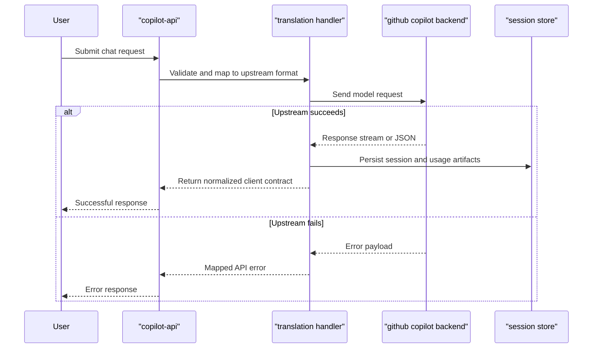

# Core Business Workflows

The application provides a compatibility proxy workflow that lets users send OpenAI- or Anthropic-style requests and receive translated responses backed by GitHub Copilot. It also supports operational workflows for usage monitoring and local session inspection.

## Domain Entities

| Entity | Service / Bounded Context | Description | Key Relationships |
|---|---|---|---|
| API Request | API Translation | Incoming OpenAI/Anthropic payload provided by the client | Translated into Copilot backend request |
| API Response | API Translation | Outbound response normalized to requested client contract | Produced from Copilot response stream/data |
| Session Record | Session Logging | Stored request/response event for dashboard inspection | Grouped under a session identifier |
| Model Usage Snapshot | Usage Tracking | Aggregated token usage by model | Updated after successful model responses |
| Auth Token State | Authentication | GitHub token and derived Copilot token lifecycle state | Required by all upstream proxy calls |

## Service-to-Domain Mapping

| Service | Domain Context | Owned Entities | External Dependencies |
|---|---|---|---|
| copilot-api route layer | API Gateway/Translation | API Request, API Response | GitHub Copilot APIs |
| session-store module | Session Observability | Session Record | Local filesystem |
| usage-tracker module | Usage Monitoring | Model Usage Snapshot | Local filesystem |
| token module | Authentication | Auth Token State | GitHub auth endpoints |

## Primary Workflows

### Workflow 1: Proxy a chat completion request

1. Client submits `POST /v1/chat/completions`.
2. Route handler validates and normalizes the payload.
3. Handler selects upstream format and sends request to Copilot backend.
4. Streaming or non-streaming response is translated back to OpenAI-compatible output.
5. Session and usage data are optionally persisted.

### Workflow 2: Retrieve usage and diagnostics

1. Client requests usage via `GET /usage` or local usage via `GET /token-usage`.
2. Service fetches remote usage from GitHub (for `/usage`) or reads local aggregated usage file (for `/token-usage`).
3. Service returns structured JSON for monitoring workflows.

## Cross-Service Data Flows

The primary composition flow is from client contract to upstream Copilot contract and back. Route handlers perform payload translation and response normalization but no multi-service data merge across internal microservices, because this repository runs as a single deployable unit. Fallback behavior is mostly error mapping; if upstream requests fail, handlers return translated error responses through shared error forwarding utilities.

## Business Workflow Sequence

## Business Rules & Decision Logic

- Requests are validated and translated based on target API contract (OpenAI chat/responses or Anthropic messages).
- Route-level error handling uses a shared forwarder to return consistent HTTP responses.
- Session persistence and usage tracking are optional operational side effects and should not block main response flow on file write failure.
- Authentication state must be initialized before serving model requests; missing/invalid token state causes early request failure.
