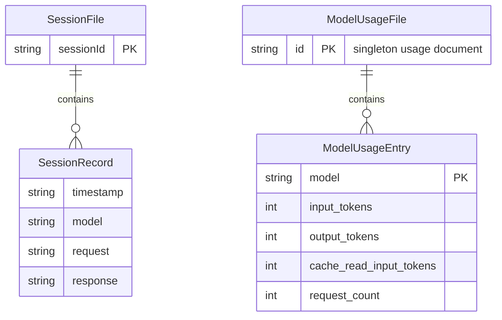

# Data Architecture & Persistence Layer

The project uses lightweight file-based persistence instead of an external database. Data storage is focused on operational telemetry and local auth/session state.

## Database Configuration

| Service/Module | DB Type | Profile | Driver | Connection | Migration Tool |
|---|---|---|---|---|---|
| copilot-api | File-based JSON storage | default | Node fs / Bun runtime | local filesystem under project/user data paths | None |

## Data Ownership per Service

| Service | Tables Owned | ORM Framework | Caching | Notes |
|---|---|---|---|---|
| copilot-api | `sessions/*.json`, `token-usage.json`, `~/.local/share/copilot-api/github_token` | None | In-memory maps and state object plus persisted JSON files | Single service owns all persisted data |

## Entity Model

## Key Repository Methods

| Service | Repository | Notable Methods | Purpose |
|---|---|---|---|
| copilot-api | `session-store` (`src/lib/session-store.ts`) | `addRecord(sessionId, model, request, response)`, `getSessions()`, `getSession(sessionId)` | Append and query session logs |
| copilot-api | `usage-tracker` (`src/lib/usage-tracker.ts`) | `trackUsage(model, usage)`, `getUsageStats()` | Aggregate and expose model token usage |

## Caching Strategy

The service uses in-memory process state for hot data (model metadata, usage map, and runtime auth state) with periodic or event-driven persistence to local JSON files. No external distributed cache or TTL-based cache invalidation strategy is configured.

## Data Ownership Boundaries

Data ownership is centralized in one service/process. There is no cross-service database access and no shared database with separate bounded contexts. External dependencies are consumed through HTTP APIs, and local persisted artifacts are only for proxy operational state.

### Data Classification & Sensitivity

| Entity | Sensitive Fields | Classification (PII/PHI/PCI/None) | Controls in Place |
|---|---|---|---|
| GitHub token file | token string | PII-like credential / secret | File permissions set to `0600`; plaintext on disk |
| SessionRecord | request and response payloads may include user prompts | Potential PII in free text | Stored locally without masking by default |
| ModelUsageEntry | aggregate token counts only | None | Local file persistence |
