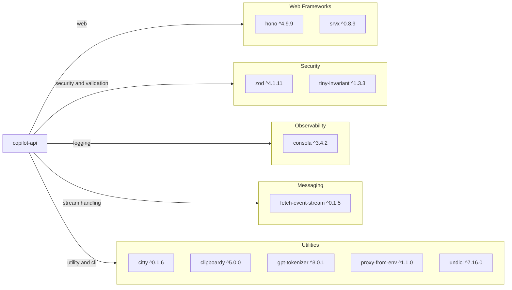

# Dependency Map

This repository is a JavaScript/TypeScript proxy application with 10 runtime dependencies and 10 development dependencies declared in `package.json`.

## Dependencies

### Dependency Summary

| Category | Count | Key Libraries | Notes |
|---|---:|---|---|
| Web Frameworks | 2 | hono, srvx | Core HTTP routing and server runtime |
| Security | 2 | zod, tiny-invariant | Request schema validation and runtime assertions |
| Observability | 1 | consola | Structured logging and CLI output |
| Messaging | 1 | fetch-event-stream | Server-sent event stream parsing |
| Utilities | 5 | citty, undici, gpt-tokenizer | CLI, HTTP client, model/token helpers |

### Version & Compatibility Risks

`undici` and `hono` are actively maintained and modern. The runtime coupling to Bun means deployment environments must support Bun-compatible APIs and behavior. No obvious end-of-life framework is declared, but regular updates are important due to HTTP client and parsing libraries in the request path.

### Notable Observations

- The runtime dependency set is intentionally compact for a proxy service.
- Validation and translation rely heavily on `zod`, making schema compatibility central to stability.
- Both `bun.lock` and `package-lock.json` exist, indicating mixed package-manager workflows.
- Development tooling includes strict linting and TypeScript checks, but current baseline currently reports existing lint/type issues.

## Test Dependencies

| Framework | Version | Notes |
|---|---|---|
| Bun test runner | via `@types/bun ^1.2.23` | Primary test execution framework |
| ESLint | ^9.37.0 | Static analysis for code quality |
| TypeScript | ^5.9.3 | Compile-time type checking |

Total test-scope dependencies: 3
The project has basic unit tests with Bun but no dedicated integration testing framework dependency declared.
